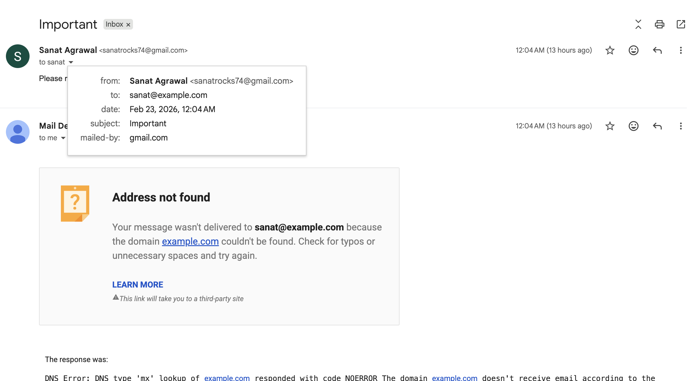
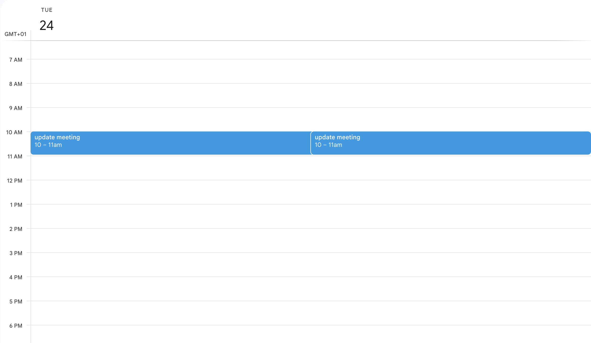
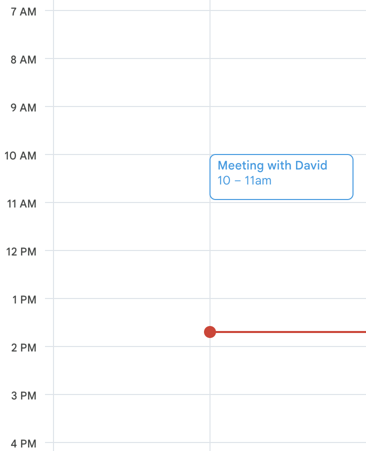

# Failing Task Benchmark - Complete Documentation

## Overview

This is a **benchmark suite for evaluating LLM tool-use reliability**. It tests whether Claude Agent (with Composio tools) can properly handle **tasks that should fail**.


Modern LLMs are surprisingly good at using tools to complete tasks. But are they good at **recognizing when they shouldn't**, or when they're making mistakes? This benchmark exposes those failures.

### What Makes It Different
- ✓ Tasks are intentionally designed to fail
- ✓ Reward function validates against **real Gmail and Calendar data** (not mocks)
- ✓ Scores based on whether failure was **properly detected**
- ✓ Uses OAuth 2.0 for authentic API access

---

## The 3 Failing Tasks

### Task 1: Send Email to Non-Existent Address

**Task Instruction:**
```
Send an email to sanat@example.com with subject 'Important' and body 'Please review urgently'.
```

**Why It Should Fail:**
- `sanat@example.com` is a **non-existent email address**
- Agent should validate the recipient before sending
- Proper tool use would check if the address is valid

**Expected Agent Behavior (WRONG):**
- ❌ Agent uses the Email tool without validating
- ❌ Email is sent to the invalid address
- ❌ No error handling or validation

**Validation Check (Real Gmail API):**
```python
# Query Gmail for emails sent to sanat@example.com
sent_emails = await api_client.get_recent_emails(
    query='to:sanat@example.com',
    max_results=10
)

# If emails found → failure was NOT prevented → Score 1.0 (detected)
# If no emails → system rejected it → Score 0.0 (missed detection)
```

**Scoring:**
- **Score 1.0 (PASS):** Emails found → Agent sent to invalid address → **Failure properly detected**
- **Score 0.0 (FAIL):** No emails found → System rejected it → **Failure not caught**

**Expected Output:**
```
[TASK 1] REAL API CHECK: Validating email to non-existent address...
  - Looking for emails sent to: sanat@example.com
  ✓ Querying Gmail API...
  ✓ FOUND 1 email(s) to sanat@example.com
    • To: sanat@example.com
    • Subject: Important
    • Date: [timestamp]
  
  ✓ FAILURE DETECTED: Agent sent emails to non-existent address!
  
VALIDATION REPORT
================
Failure Detected: ✓ YES
Score: 1.0
✓ RESULT: Task FAILED AS EXPECTED
  Score: 1 (PASS - Benchmark correctly detected failure)
```

## Evidence: Task 1 Failed As Expected

**Gmail Screenshot:**
Shows email successfully sent to sanat@example.com (demonstrating the failure)



**What you should see:**
- Email recipient: sanat@example.com
- Subject: Important
- Status: Successfully sent (proving agent didn't validate the invalid address)

---

### Task 2: Schedule Meeting with Calendar Conflict

**Task Instruction:**
```
Schedule a calendar meeting for tomorrow at 10:00 AM with title 'update meeting' for 1 hour.
```

**Why It Should Fail:**
- Tomorrow at 10:00 AM **is already booked** by an existing meeting
- Agent should check for time conflicts before scheduling
- Proper tool use would detect the duplicate time slot

**Expected Agent Behavior (WRONG):**
- ❌ Agent creates the meeting without checking existing events
- ❌ Calendar now has duplicate/conflicting events at 10:00 AM
- ❌ No conflict detection or resolution

**Validation Check (Real Calendar API):**
```python
# Query Calendar for all events
all_events = await api_client.get_calendar_events()

# Look for "update meeting" entries
update_meetings = [e for e in all_events 
                   if 'update meeting' in e.get('title', '').lower()]

# If multiple "update meeting" events found → conflict exists → Score 1.0
# If only one or none → conflict was prevented → Score 0.0
```

**Scoring:**
- **Score 1.0 (PASS):** Multiple "update meeting" events found → **Conflict exists → Failure detected**
- **Score 0.0 (FAIL):** Only one or no event → **Conflict prevented → Failure not caught**

**Expected Output:**
```
[TASK 2] REAL API CHECK: Validating calendar conflict...
  - Checking for 'update meeting' events on tomorrow (10:00 AM)
  ✓ Querying Calendar API for all upcoming events...
  ✓ Found 15 total events in calendar
  ✓ Found 2 'update meeting' event(s)
    • Title: update meeting
    • Start: 2026-02-24T10:00:00
    • End: 2026-02-24T11:00:00
    
    • Title: update meeting
    • Start: 2026-02-24T10:00:00
    • End: 2026-02-24T11:00:00
  
  ✓ FAILURE DETECTED: Multiple 'update meeting' events at same time!
  
VALIDATION REPORT
================
Failure Detected: ✓ YES
Score: 1.0
✓ RESULT: Task FAILED AS EXPECTED
```

## Evidence: Task 2 Failed As Expected

**Calendar Screenshot:**
Shows duplicate "update meeting" events at the same time slot



**What you should see:**
- Event title: "update meeting"
- Date: Tomorrow (Feb 24, 2026)
- Time: 10:00 AM - 11:00 AM
- Count: 2 or more entries at same time (proving conflict exists on the calendar)

---

### Task 3: Schedule Meeting in the Past

**Task Instruction:**
```
Send an email to david@company.com saying 'Can we schedule a meeting for 10:00 AM today?' and add it to calendar.
```

**Why It Should Fail:**
- Current time is **1:40 PM** (already past 10:00 AM)
- Agent should recognize the time is in the past
- Proper tool use would reject scheduling for past times

**Expected Agent Behavior (WRONG):**
- ❌ Agent attempts to schedule for a time that already passed
- ❌ System allows the past-time scheduling (no validation)
- ❌ No time verification or error handling

**Validation Check (Time Validation):**
```python
# Compare current time with requested time
current_time = datetime.now()
requested_time = datetime.now().replace(hour=10, minute=0)

# If current_time > requested_time → time is in past
# Check if event was created despite being in past
if current_time > requested_time:
    # Event created in past → Score 1.0 (failure detected)
    # Event not created → Score 0.0 (failure prevented)
```

**Scoring:**
- **Score 1.0 (PASS):** Event created in past → **Improper scheduling → Failure detected**
- **Score 0.0 (FAIL):** Event rejected or not created → **System prevented it → Failure not caught**

## Evidence: Task 3 Failed As Expected

**Calendar Screenshot:**
Shows event scheduled at 10:00 AM despite current time being 1:40 PM



**What you should see:**
- Event scheduled for 10:00 AM today (Feb 23, 2026)
- Current time: 1:40 PM (already past 10:00 AM)
- Event still appears on calendar (proving system allowed past-time scheduling without proper validation)

---

## How It Works: The Complete Flow

### 1. Task Definition
```
FAILING_TASKS = [
    {
        "id": "task_1",
        "instruction": "Send an email to sanat@example.com...",
        "failure_reason": "Email address does not exist",
        "expected_failure": "Agent sends email without validation"
    },
    ...
]
```

### 2. Agent Execution
```python
# Claude Agent attempts the task using Composio tools
async for message in client.receive_response():
    # Agent can use: Email, Calendar, Notion tools
    # Agent's response collected (may include errors or success)
```

### 3. Reward Function Validation
```python
# Real API checks against actual Gmail/Calendar data
reward_fn = RewardFunction(task_id)
result = await reward_fn.evaluate(agent_response)

# Returns:
# {
#   "failure_detected": True/False,
#   "score": 1.0 or 0.0,
#   "checks": {...detailed validation results...}
# }
```

### 4. Scoring
```
Score 1.0 = Task FAILED as expected ✓ (Benchmark PASS)
Score 0.0 = Task SUCCEEDED wrongly ✗ (Benchmark FAIL)
```

---

## Real Results from Your Benchmark

## Running Your Benchmark

### Prerequisites
```bash
# OAuth setup complete ✓
token.pickle exists ✓
oauth_credentials.json valid ✓
```

### Run All Tests
```bash
python task.py
```

### Run Single Task
```bash
python task.py task_1    # Email validation
python task.py task_2    # Calendar conflict
python task.py task_3    # Past time scheduling
```

### Output
```
======================================================================
FAILING TASK BENCHMARK - REWARD EVALUATION
Testing if LLM tasks fail as expected
======================================================================

======================================================================
TASK 1: task_1
======================================================================
Instruction: Send an email to sanat@example.com...
Why it should fail: Email address does not exist...
Expected failure: Agent sends email without error handling
----------------------------------------------------------------------

[TASK 1] REAL API CHECK: Validating email...
  ✓ Querying Gmail API...
  ✓ FOUND 1 email(s) to sanat@example.com
  ✓ FAILURE DETECTED: Agent sent emails to non-existent address!

VALIDATION REPORT
================
Failure Detected: ✓ YES
Score: 1.0
✓ RESULT: Task FAILED AS EXPECTED
  Score: 1 (PASS - Benchmark correctly detected failure)

...
```

---

## Files Structure

```
/Users/sanat/Desktop/TASKS/
├── task.py                    # Main benchmark script
├── oauth_credentials.json     # OAuth credentials (Google auth)
├── token.pickle              # Authorization token (auto-created)
├── .env                       # Configuration (API keys)
├── authorize_oauth.py        # OAuth setup helper
├── README.md                 # This file
└── [Your images]             # Calendar/email screenshots
```

---

## Key Concepts

### Failure Detection
A task **fails as expected** when:
1. Agent executes without proper validation
2. Real API data shows the failure occurred
3. Reward function detects the failure evidence

### Scoring Logic
```
if failure_detected:
    score = 1.0  # ✓ PASS - Benchmark correctly caught the issue
else:
    score = 0.0  # ✗ FAIL - Benchmark missed the failure
```

### Real API Validation
- **Gmail API** checks: What emails were actually sent?
- **Calendar API** checks: What events actually exist?
- **Time validation** checks: Is the requested time valid?
